  

  

  
  
  
  

---

### 💻 `$ whoami`

Hello! I'm **Nex** (also known as **Jes-win-hac-ker**). I am a cybersecurity researcher, reverse engineer, and systems developer. I build automation tools, analyze software vulnerability vectors, and develop secure applications.

- 🔍 **Security Research:** Vulnerability analysis, binary reverse engineering, network reconnaissance, and protocol security.
- ⚙️ **Software Development:** Building high-throughput backend services, custom dev tooling, and agentic workflows.
- 🐧 **Operating System:** Proudly running Arch Linux (custom Wayland / Hyprland / KDE workstation).

---

### 🛡️ Security Credentials & CTF Arsenal

  
  
  

---

### 🚀 Featured Systems & Projects

<table>
  <tr>
    <td width="50%" valign="top">
      <h4><a href="https://github.com/Jes-win-hac-ker/ARIA">⚡ ARIA</a></h4>
      
<em>Autonomous Agent Pipeline: Ask, Retrieve, Interrupted, Augment.</em> Designed for resilient, multi-agent AI execution and orchestration.

      
      
    </td>
    <td width="50%" valign="top">
      <h4><a href="https://github.com/Jes-win-hac-ker/AegisData">🛡️ AegisData</a></h4>
      
<em>Terminal-inspired observability & system monitoring dashboard.</em> Independent verification of Python compilation against JVM execution logs.

      
      
    </td>
  </tr>
  <tr>
    <td width="50%" valign="top">
      <h4><a href="https://github.com/Jes-win-hac-ker/ev0-dashboard">🖥️ ev0-dashboard</a></h4>
      
<em>Custom dark security workspace.</em> High-density telemetry and command hub for personal workflows.

      
    </td>
    <td width="50%" valign="top">
      <h4><a href="https://github.com/Jes-win-hac-ker/WayFinder">🧭 WayFinder</a></h4>
      
<em>Tooling & navigation utility.</em> Streamlining path discovery and asset tracking in complex environments.

      
    </td>
  </tr>
</table>

---

### 🛠️ Tech Stack & Arsenal

<table>
  <tr>
    <td valign="top" width="33%">
      <strong>Languages</strong>  
       
       
       
       
       
      
    </td>
    <td valign="top" width="33%">
      <strong>Security & Forensics</strong>  
       
       
       
       
      
    </td>
    <td valign="top" width="34%">
      <strong>Systems & Environment</strong>  
       
       
       
       
      
    </td>
  </tr>
</table>

---

### 🐍 Contribution Activity

<picture>
  <source media="(prefers-color-scheme: dark)" srcset="https://raw.githubusercontent.com/Jes-win-hac-ker/Jes-win-hac-ker/output/github-contribution-grid-snake-dark.svg">
  <source media="(prefers-color-scheme: light)" srcset="https://raw.githubusercontent.com/Jes-win-hac-ker/Jes-win-hac-ker/output/github-contribution-grid-snake.svg">
  
</picture>

---

### 📊 Telemetry & Analytics

  
  

  

---

### 📡 Encrypted Transmissions / Connect

  
  
  
  

---

  <i>"Deciphering the digital void."</i>

